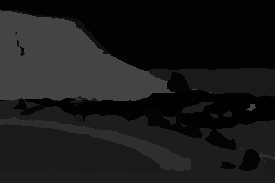
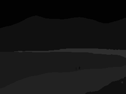
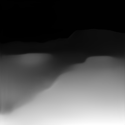
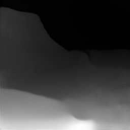
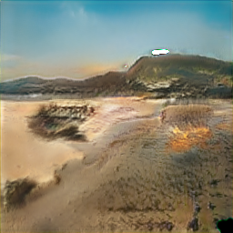
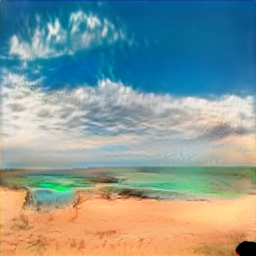
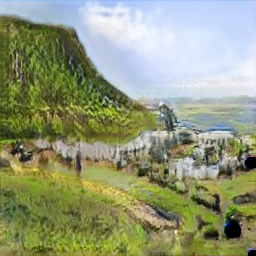
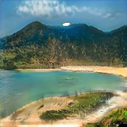

# ViSyn

ViSyn is a PyTorch implementation of a two-stage landscape image synthesis pipeline inspired by the StyLandGAN paper.

The pipeline generates landscape images from semantic segmentation maps using two sequential generators:

1. Segmentation-to-Depth (S2D)
2. Segmentation+Depth-to-Image (SD2I)

Unlike traditional semantic-only image synthesis pipelines, ViSyn uses both segmentation maps and depth maps as conditioning signals. Segmentation maps provide semantic structure, while depth maps provide geometric and spatial information about the scene layout.

This additional depth conditioning helps the model generate landscapes with more consistent perspective, scale, terrain structure, and spatial coherence compared to segmentation-only generation approaches.

The overall pipeline follows a two-stage generation process:
1. Generate a plausible depth map from the segmentation map
2. Generate the final landscape image using both segmentation and depth information.

The implementation is designed around a StyleGAN-inspired conditional generation pipeline with progressive synthesis and multi-scale conditioning.

The original StyLandGAN paper PDF is included directly in this repository for reference.

---

# Installation

Clone the repository:

```bash
git clone https://github.com/your-username/ViSyn.git

cd ViSyn
```

Install dependencies:

```bash
pip install -r requirements.txt
```

---

# Downloading Checkpoints

Download the latest checkpoint files from the latest GitHub Release.

Required files:

```text
s2d_latest.pth
sd2i_latest.pth
```

Place them inside:

```text
checkpoints/
```

---

# Running Inference

The repository includes sample segmentation maps inside the `samples/` directory.

You can run the full inference pipeline using:

```bash
python test.py ^
--seg samples/sample_1.png ^
--s2d checkpoints/s2d_latest.pth ^
--sd2i checkpoints/sd2i_latest.pth ^
--output-image outputs/generated.png ^
--output-depth outputs/depth.png
```

The pipeline will:

1. Generate a depth map from the segmentation map
2. Generate the final landscape image

Generated files will be written into the `outputs/` directory.

---

# Training
The training requires wandb for logging, so make sure to login using your wandb account.

The wandb logging will log the losses, sample images every few epochs which can be changed in the ```config.py```

Train the S2D generator:

```bash
python train.py --model s2d
```

Train the SD2I generator:

```bash
python train.py --model sd2i
```

---

# Dataset Format

```text
dataset/
│
├── inputs/
│   ├── 0.jpeg
│   ├── 1.jpeg
│   └── ...
│
├── segments/
│   ├── 0_segment.png
│   ├── 1_segment.png
│   └── ...
│
├── depths/
│   ├── 0_depth.png
│   ├── 1_depth.png
│   └── ...
```

---

# Example Results

## Input Segmentation





## Generated Depth






## Final Generated Landscape





---

# Notes

* Segmentation maps are processed as grayscale images
* Depth maps are generated automatically during inference
* The implementation currently targets `256x256` image generation for stability and training speed
* Checkpoint files are not included directly in the repository and must be downloaded separately from Releases

---

# Reference

The original paper used as reference for this implementation is included in the repository:

```text
stylangan_paper.pdf
```

Paper:
https://arxiv.org/abs/2205.06611
